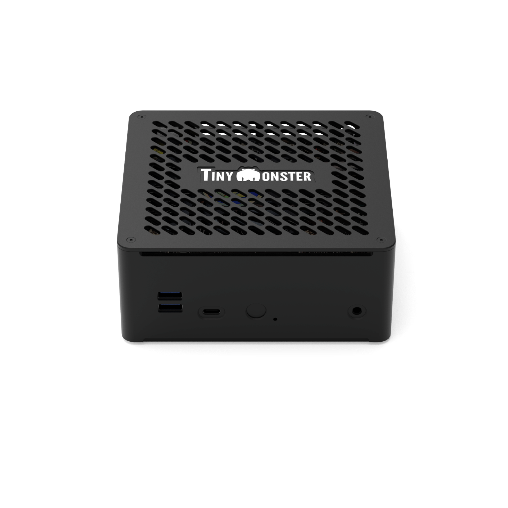
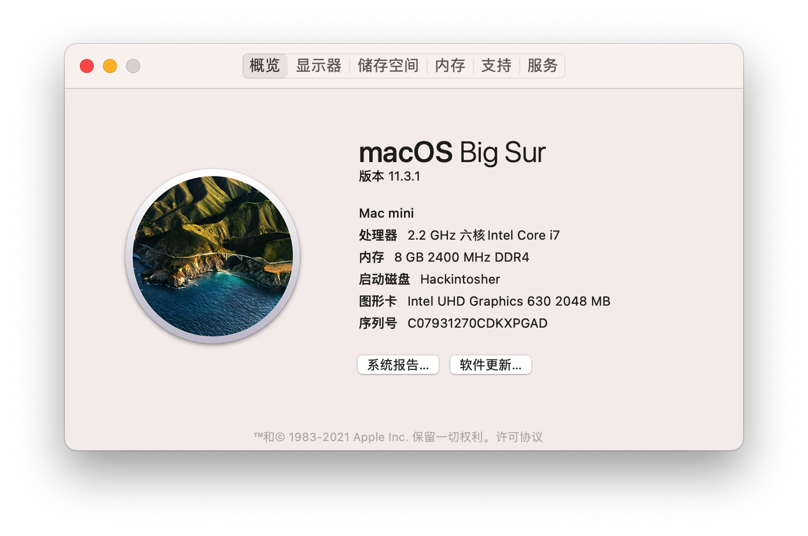
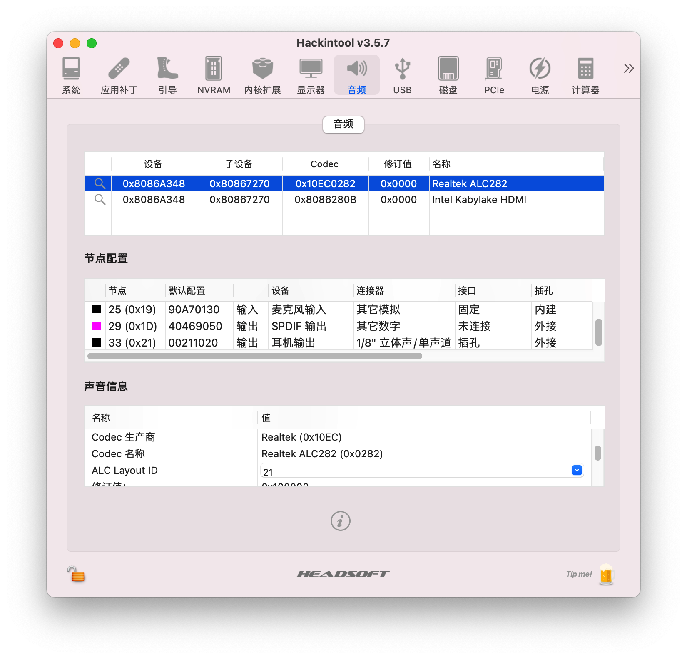
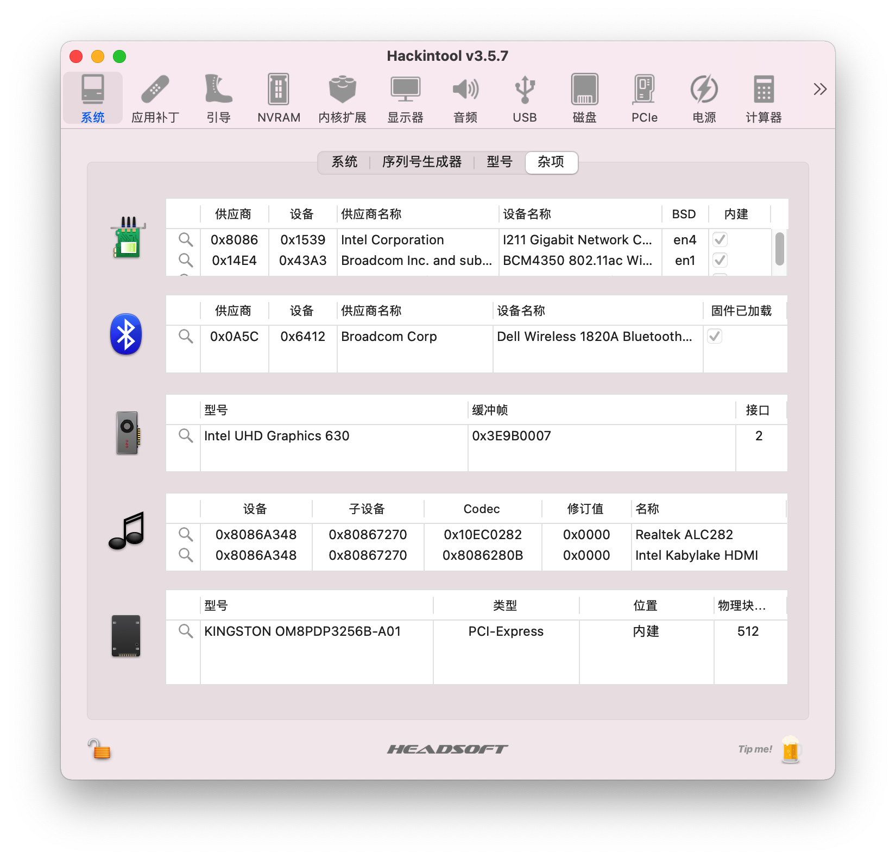
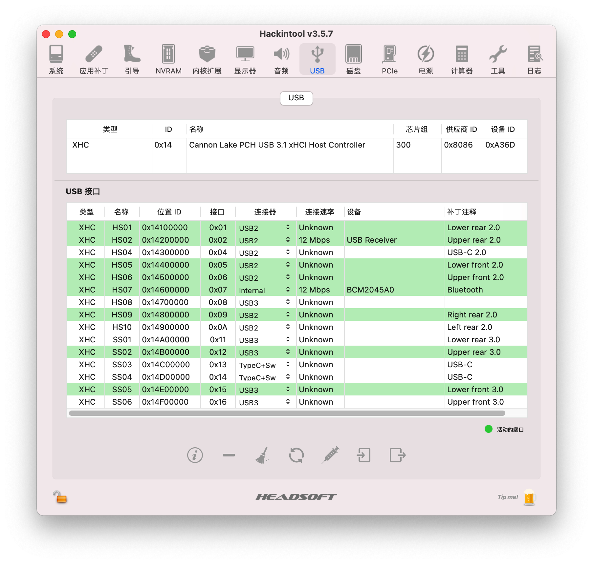
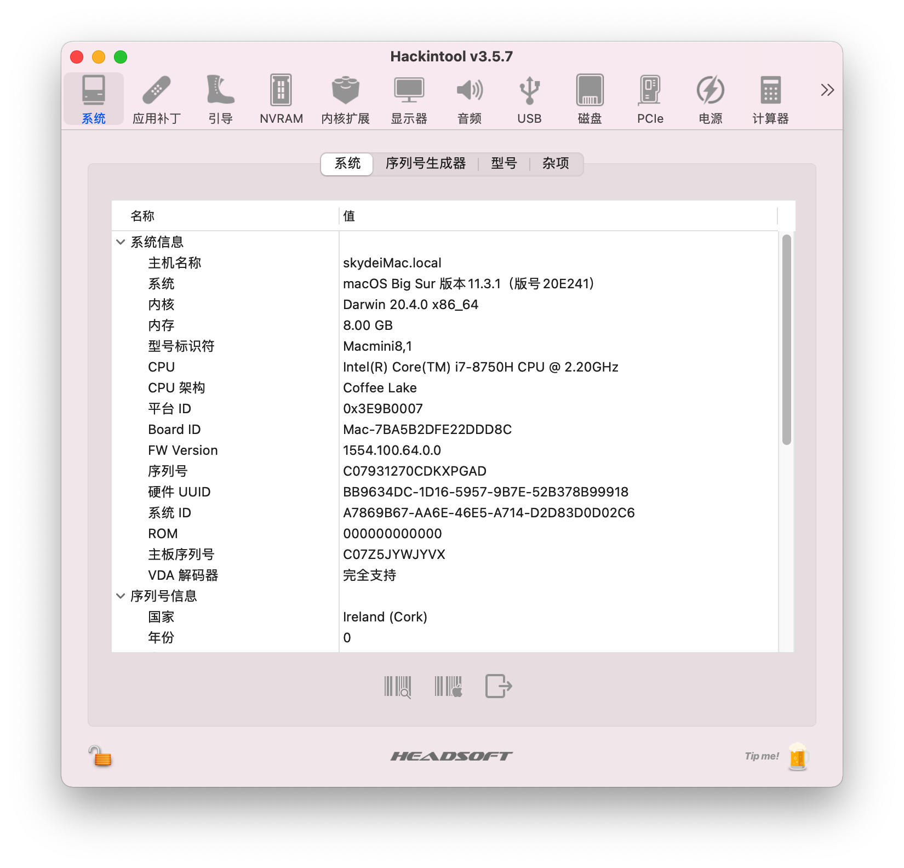
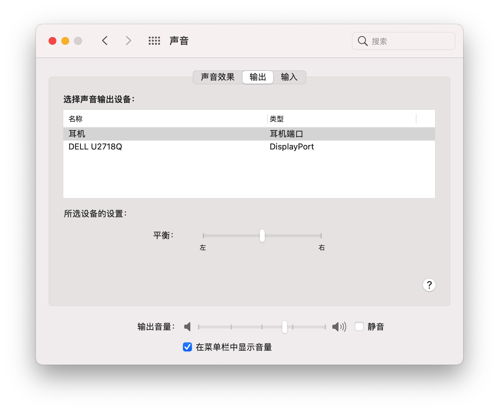
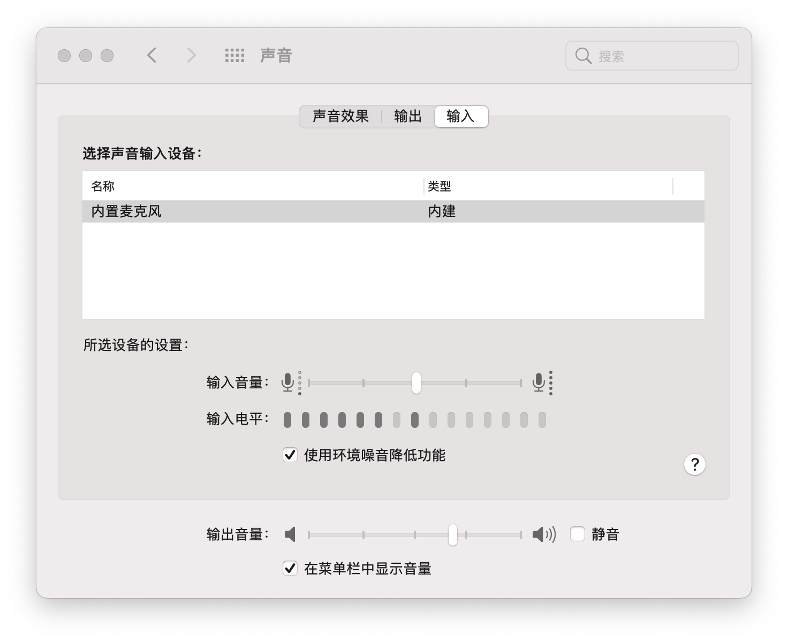
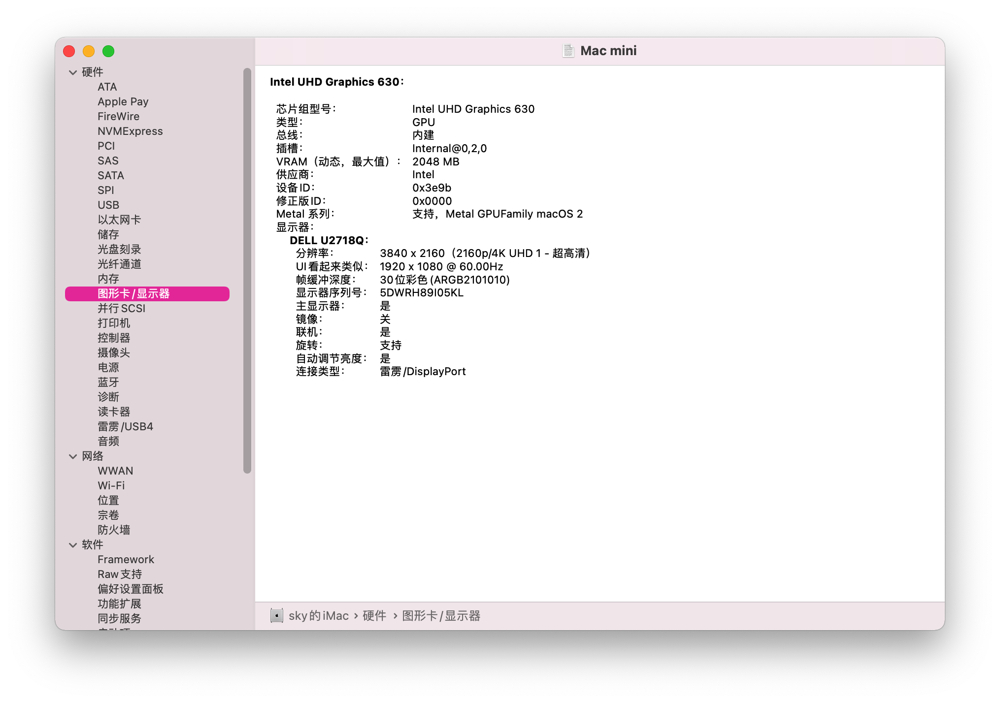

# GEEKON TinyMonster ECO Hackintosh

## 电脑配置

|   规格   |                           详细信息                           |
| :------: | :----------------------------------------------------------: |
| 电脑型号 |                       TinyMonster ECO                        |
| 操作系统 |                   macOS Big Sur / Monterey                   |
|  处理器  |                  英特尔 酷睿 i7-8750H 6C12T                  |
|   内存   |                        16 GB 2666MHz                         |
|  硬盘1   |                   KINGSTON OM8PDP3256B-A01                   |
| 硬盘2/3  |                    可接SATA 2.5寸硬盘/SSD                    |
|   显卡   |                    Intel UHD Graphics 630                    |
|  显示器  |                 支持`3840x2160 4K@60Hz`双显                  |
|   声卡   |                  Realtek ALC282 `alcid=21`                   |
|   网卡   | m.2 NGFF插槽，已更换为[BCM94360Z4](https://blog.daliansky.net/uploads/WeChatandShop.png) |

## 更新日志

- 3-12-2022
  - Release `v1.1.0`
  - OpenCore `v0.7.8`
  - 支持Monterey
- 8-11-2021
  - Release `v1.1.0`
  - OpenCore `v0.7.1`
  
- 5-20-2021
  
  - Release `v1.0.0`
  - OpenCore `v0.6.9`

## 截屏

